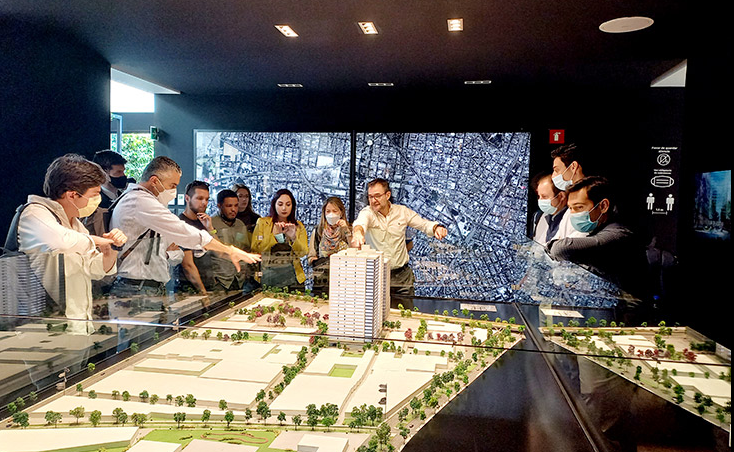

One of the biggest problems when developing an application is the architecture. Many developers make the mistake of starting to develop an application without considering the architecture first.



It may mean having to work more for many people, but over time, it is something of utmost importance, especially as the application grows.
Making architecture decisions.

<!-- truncate -->

```ts
// Define API endpoints without clear organization
const apiEndpoint1 = 'https://api.example.com/endpoint1';
const apiEndpoint2 = 'https://api.example.com/endpoint2';
const apiEndpoint3 = 'https://api.example.com/endpoint3';

// Call API 1 without understanding its purpose or expected data format
fetch(apiEndpoint1)
  .then(response => {
    // Forget to check for errors or handle response data properly
    processData(response.data);
  })
  .catch(error => {
    // No error handling, let errors propagate
    console.error('Error calling API 1:', error.message);
  });

// Call API 2 with incorrect parameters and no error handling
fetch(apiEndpoint2 + '?param=abc')
  .then(response => response.json())
  .then(data => {
    // Attempt to access undefined properties of response data
    console.log('Data from API 2:', data.result);
  });

// Attempt to call API 3 synchronously 
// without waiting for responses from APIs 1 and 2
const response3 = fetch(apiEndpoint3).json();
// Forget to await response, resulting in undefined data
console.log('Data from API 3:', response3);

// Proceed without understanding API rate limits or authentication requirements
// Risking API throttling or unauthorized access

// And finally, wonder why the code is not working as expected
console.log("This is chaos! We need better API management!"); // TOO LATE!!!!
```

An architect is expected to define the architecture *decisions* and *designed principles* used to guide technology decisions within the team the department or across the enterprise.

Guide is the key operative word in this first expectation. An architect should guide rather than specify technology choices. For example, an architect might take a decision to use react JS for front end development. In this case, the architect is making a technical decision rather than an architectural decision or design principle that will help the development team making choices.
But why we need it? 

### Let’s try to visualize it in a real-world scenario. 

Let’s image you are a millionaire person, and you want to build a 20 floors hotel, however you don’t know anything about building hotels or maybe you do, or partially you might know what you need:


<ol>
<li>Excavation contractor</li>
<li>Steel or concrete structure contractor</li>
<li>Concrete contractor</li>
<li>Masonry contractor</li>
<li>Mechanical and electrical installations contractor, among others</li>
</ol>


Great! They know how to build stuff! With those guys it is enough to build the hotel. Well, unfortunately that’s not how it works if you want to build your 20 floors hotel correctly, avoid future problems, and make stable and scalable, it is true excavation contractor know how to excavate, steel and concrete contractor know how to manage steel and concrete, same with the rest, but, where, when and why is the question for this scenario.


#### The excavation contractor, eager to start work, begins digging the foundation without conducting a thorough site survey. As a result, they encounter unexpected underground obstacles such as utility lines and rock formations, leading to delays and additional costs for relocation and blasting.

#### The steel and concrete contractors, eager to make progress, start erecting the building's structure before the structural plans are fully approved by the architect and engineer. This results in discrepancies between the actual construction and the approved plans, leading to structural integrity concerns and the need for costly modifications later on.

Throughout the construction process, there is a lack of comprehensive quality control measures and inspections to identify and address issues promptly. As a result, construction defects go unnoticed until later stages, leading to costly rework and potential safety hazards for occupants.
Like these can be many scenarios, and guess what, the same happens in **software development**.

Imagine every contractor as a **developer**, front-end developer, back-end developer, database developer, quality assurance and so on, all these members are good in every field, however, if they do not have someone that guides all the construction (software development), possibly your 20 floors hotel will collapse in one moment.

So, that’s why it is always important to have a software architecture to guide the construction in every moment. 

:::danger[Don't]

DO NOT make the same mistake to tell you team hurry up! this is urgent, hurry up! we need it for tomorrow because this is what happens you want everything fast. 

:::
If you want a nice book about this, I recommend **Fundamental of Software Architecture** from O’Reilly.

Happy coding!! 

